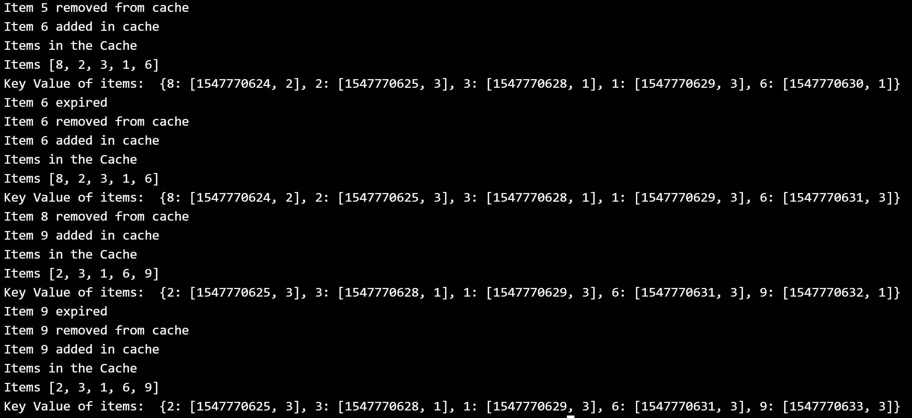

# LRU with time Expiry:

# Sample output for Cache Size of 5.

# Features:
1. Multi-treaded: There are multiple threads acting as traffic data from different Geolocation. Threads are synchronized to make writing Real-time.
2. Expiry: Every data item in cache has an expiry time. Current time and valid duration of item is stored in a dictionary.

# implementation

## Cache Class
This implements the least recently used cache with time expiry. It has four important methods

### put
This method is responsible for removing items before adding into the queue. It also removes the item if it has expired

### add
Add item into the list and update the (key,value) map.

### remove
Remove item at desired index form the queue( or start of the list by default). Also update map

### removeItem
Remove desired item form the queue. Also remove item from map.
